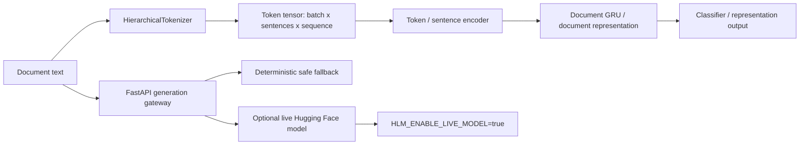
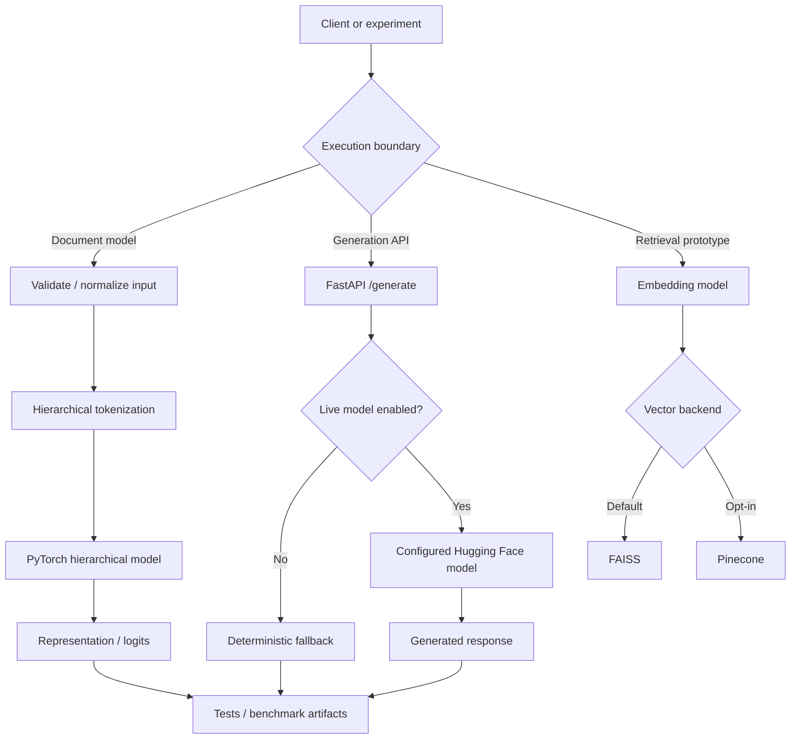

# Hierarchical Language Model

[](https://github.com/CoreyLeath-code/-Hierarchical-Language-Model/actions/workflows/ci.yml)
[](https://www.python.org/)
[](https://pytorch.org/)
[](https://fastapi.tiangolo.com/)
[](benchmark-results.json)
[](https://github.com/CoreyLeath-code/-Hierarchical-Language-Model/pkgs/container/hierarchical-language-model)
[](LICENSE)

A research-oriented PyTorch and FastAPI repository for hierarchical document representation and small-scale language-model systems experiments. The verified core path is a token-to-sentence-to-document model with deterministic tests, machine-readable benchmarks, a safe API path, and container build validation. A separate from-scratch decoder-only language-model harness is included for inspectable research experiments.

> **Evidence boundary:** this repository does not claim frontier-language-model quality, production SLOs, internet-scale serving, regulatory readiness, or large-corpus model quality. Numerical claims below are limited to checked-in tests and benchmark artifacts.

## What is verified

- hierarchical tokenization and tensor-shape contracts
- compact PyTorch hierarchical model forward path
- deterministic FastAPI fallback/API contract behavior
- CPU from-scratch LLM smoke experiments
- deterministic benchmark JSON generation and validation
- Ruff lint/format, import compilation, pytest coverage, Docker build, Bandit, and `pip-audit` in CI
- local FAISS-oriented retrieval path with Pinecone as an opt-in external backend
- Python 3.11 container build

## What is not claimed

- frontier-model language quality or general reasoning ability
- distributed training or multi-node inference as a verified runtime path
- production concurrency, autoscaling, SLOs, or capacity numbers
- Pinecone availability/performance in CI
- safety certification or comprehensive red-team coverage
- model-quality conclusions from synthetic smoke data

## Architecture flowchart



## System design flow



The CI-supported core is intentionally narrower than the full research surface. Prototype retrieval, dashboard, and live-model paths are not treated as equivalent to the deterministic core.

## Quick Start

### 1. Clone and create an environment

```bash
git clone https://github.com/CoreyLeath-code/-Hierarchical-Language-Model.git
cd -- -Hierarchical-Language-Model
python -m venv .venv
source .venv/bin/activate
python -m pip install --upgrade pip
python -m pip install -r requirements.txt -r requirements-dev.txt
```

PowerShell activation:

```powershell
.\.venv\Scripts\Activate.ps1
```

### 2. Run the deterministic validation path

```bash
ruff check api hierarchical_lm benchmarks research tests
ruff format --check api hierarchical_lm benchmarks research tests
pytest --cov=api --cov=hierarchical_lm --cov-report=term-missing
python -m compileall -q api hierarchical_lm benchmarks research tests
```

### 3. Run the benchmark harness

```bash
python benchmarks/benchmark_hlm.py --iterations 100 --output benchmark-results.json
python -m json.tool benchmark-results.json
```

### 4. Run the from-scratch LLM smoke experiment

```bash
python research/llm_from_scratch.py \
  --mode smoke \
  --steps 5 \
  --device cpu \
  --output artifacts/llm-smoke.json
```

Synthetic smoke data validates plumbing and optimization behavior only; it is not evidence of language quality.

### 5. Run the API safely

```bash
uvicorn api.main:app --reload --host 0.0.0.0 --port 8000
```

The live Hugging Face path remains opt-in:

```bash
export HLM_ENABLE_LIVE_MODEL=true
export HLM_MODEL_NAME=meta-llama/Meta-Llama-3-8B-Instruct
uvicorn api.main:app --host 0.0.0.0 --port 8000
```

Model access, hardware, licensing, and model-revision pinning are the operator's responsibility.

## Container Quick Start

```bash
docker build -t hierarchical-language-model:local .
docker run --rm -p 8000:8000 hierarchical-language-model:local
curl http://localhost:8000/healthz
```

The image currently serves `deployment/app.py`, whose health endpoint and document-ingestion contract are distinct from the richer `api/main.py` generation gateway. That boundary is intentional and documented rather than presenting the two surfaces as one service.

## Evidence and reproducibility

A claim is portfolio-grade only when a reviewer can identify the command, input class, runtime, sample count, and artifact supporting it.

| Evidence class | Reproduction path | Current boundary |
|---|---|---|
| Correctness | `pytest --cov=api --cov=hierarchical_lm --cov-report=term-missing` | deterministic local/CI paths |
| Static quality | Ruff + `compileall` | `api`, `hierarchical_lm`, `benchmarks`, `research`, `tests` |
| Security hygiene | Bandit + `pip-audit` | source/dependency hygiene, not a penetration test |
| Container | `docker build ...` | build validation, not runtime capacity |
| Performance | `benchmarks/benchmark_hlm.py` | compact CPU synthetic workloads |
| LLM smoke | `research/llm_from_scratch.py --mode smoke` | optimization/plumbing, not language quality |
| Release | semantic tag + GitHub Release workflow | immutable source archive + checksum |
| Package | semantic tag + GHCR workflow | versioned container image |

### Clean-checkout reproduction checklist

1. Record `git rev-parse HEAD`.
2. Use Python 3.11.
3. Install `requirements.txt` and `requirements-dev.txt` without modifying source.
4. Run lint, format verification, tests, and import compilation.
5. Regenerate `benchmark-results.json` with 100 iterations.
6. Compare the command, workload definition, runtime, and hardware before comparing numerical results.
7. Treat changed dependency/runtime/hardware environments as new experiment conditions.

## Research-style benchmark and metrics

### Research question

What is the steady-state latency of the repository's compact deterministic preprocessing, model-forward, and fallback paths under a CPU execution environment?

### Protocol

The checked-in benchmark artifact records 100 iterations for four compact workloads. It reports mean, median, p95, minimum, and maximum latency. The artifact identifies the harness and CPU device, but it does not currently record detailed CPU model, OS, Python/PyTorch versions, warm-up count, memory use, concurrency, or commit SHA; those omissions are tracked as reproducibility improvements rather than silently inferred.

### Checked-in reference results

| Workload | Mean | Median | p95 | Evidence |
|---|---:|---:|---:|---|
| Tokenizer document encoding | 0.007402 ms | 0.006550 ms | 0.008000 ms | `benchmark-results.json` |
| Dataset materialization | 0.028561 ms | 0.025100 ms | 0.044400 ms | `benchmark-results.json` |
| Model forward pass | 2.207161 ms | 2.189750 ms | 2.790500 ms | `benchmark-results.json` |
| API safe fallback generation | 0.000217 ms | 0.000200 ms | 0.000200 ms | `benchmark-results.json` |

These are **single-process microbenchmark results**, not service-level latency, concurrent throughput, end-to-end request latency, or live Hugging Face generation performance.

### Correctness/quality signals currently recorded

| Signal | Recorded value | Interpretation |
|---|---:|---|
| Tests | 13 passing | test-case count, not exhaustive correctness |
| Runtime package coverage | 87% | measured for `api` + `hierarchical_lm` scope |
| Benchmark JSON validation | passing | structural validity only |
| Live model downloads required by CI | 0 | deterministic CI path |

### Threats to validity

- synthetic compact inputs can underrepresent realistic document distributions
- shared or different CPUs can materially alter latency
- no current benchmark evidence supports concurrent-load or service-capacity claims
- fallback generation is intentionally trivial and should not be compared with real model inference
- one seed/run is insufficient for model-quality conclusions

## From-scratch LLM research contract

The repository includes a small decoder-only model to expose architecture and experiment mechanics rather than hide them behind a hosted API. Any future scaling-law claim should report at minimum parameter count `N`, training-token count `D`, estimated FLOPs, hardware, peak memory, held-out loss, train/validation gap, seed count, and fit residuals. A function such as `L(N,D) = E + A/N^alpha + B/D^beta` should only be fitted after multiple controlled experiment points exist.

Before claiming post-training improvement, compare checkpoints on the same frozen evaluation suite and report uncertainty. Retrieval grounding should use retrieval metrics such as recall@k/MRR plus citation or grounded-answer metrics; safety work should separately report refusal/jailbreak/privacy regressions.

See [`docs/llm-systems-research.md`](docs/llm-systems-research.md) for the extended research protocol.

## Retrieval backends

| Backend | Role | CI dependency |
|---|---|---|
| FAISS | default local/offline vector backend | none |
| Pinecone | hosted opt-in vector store | excluded from deterministic CI |

Example Pinecone configuration:

```bash
cp .env.example .env
# Configure in .env or a secret store, never source control:
VECTORSTORE_BACKEND=pinecone
PINECONE_API_KEY=***
PINECONE_INDEX_NAME=hlm-documents
PINECONE_NAMESPACE=hlm-documents
EMBEDDING_MODEL=sentence-transformers/all-MiniLM-L6-v2
```

## CI and engineering gates

The existing workflow executes nine named hygiene tiers on Python 3.11:

1. checkout
2. Python setup
3. dependency installation
4. Ruff lint
5. Ruff format verification
6. import compilation
7. pytest + coverage and from-scratch LLM smoke validation
8. benchmark JSON generation/validation
9. Docker build, Bandit, and `pip-audit`

CI uploads the benchmark artifact for inspection. A green workflow demonstrates those gates passed for that revision; it does not by itself prove production readiness.

## Release and package contract

The v1.1.0 release-prep branch adds two explicit publishing paths:

- **GitHub Release:** semantic tag `vX.Y.Z` → source archive + SHA-256 checksum + generated release notes
- **GHCR:** semantic tag `vX.Y.Z` → `ghcr.io/coreyleath-code/hierarchical-language-model:vX.Y.Z` and `latest`

The container image carries OCI source/version/revision/license labels so GitHub can associate the package with this repository.

## Extended Q&A

**Why use a hierarchical model when transformers exist?**  
The hierarchical path is useful as an inspectable research baseline where sentence/document aggregation and tensor contracts are explicit. This repository does not claim that it outperforms modern transformers.

**Does the benchmark prove the API is fast?**  
No. It measures compact in-process functions and a deterministic fallback. A real API claim needs networked request measurements, concurrency, resource limits, error rate, and representative payloads.

**Is the Pinecone path production-tested?**  
No. Pinecone is an opt-in integration path. Deterministic CI does not require credentials or network access.

**What does 87% coverage mean?**  
It is the currently recorded coverage for the `api` and `hierarchical_lm` runtime package scope. It is not a claim that 87% of every prototype/research module is covered.

**Why keep the live model disabled by default?**  
To keep CI reproducible without gated credentials, large downloads, or GPU requirements and to separate deterministic software verification from external model availability.

**Does the from-scratch smoke loss prove learning quality?**  
No. It proves the optimization/training plumbing can execute on synthetic data. Language quality requires a real dataset, frozen evaluation protocol, multiple seeds, and statistical interpretation.

**What would justify a production-serving claim?**  
A pinned model/runtime, auth and rate limits, health/readiness semantics, load tests, p50/p95/p99 latency, TTFT/ITL for generation, error rates, resource/accelerator utilization, rollback evidence, observability, and an explicit operational owner.

**Why publish a package?**  
A versioned GHCR image makes the runtime artifact inspectable and pullable. It strengthens provenance, but it does not replace tests, SBOM/security evidence, or runtime validation.

## Engineering roadmap

### Phase 1 — benchmark provenance

- record commit SHA, Python/PyTorch versions, OS, CPU model, warm-up count, seed, and memory in benchmark artifacts
- add p99 and optional repeated-run confidence intervals
- define an immutable benchmark fixture

**Acceptance evidence:** versioned JSON schema and CI artifact containing complete environment/provenance fields.

### Phase 2 — contract depth

- expand negative API/input tests
- add persistence/retrieval adapter contract tests
- clearly separate core coverage from prototype-extension coverage

**Acceptance evidence:** deterministic tests demonstrating failure semantics and backend contract behavior.

### Phase 3 — supply chain

- generate an SBOM for release images
- scan the release image for fixable HIGH/CRITICAL vulnerabilities
- sign published images with keyless Cosign
- pin critical external action/dependency revisions where appropriate

**Acceptance evidence:** release workflow artifacts plus verifiable image signature.

### Phase 4 — model/retrieval research

- introduce frozen datasets and multiple seeds
- report held-out loss/perplexity with confidence intervals
- evaluate retrieval recall@k/MRR and grounding separately
- add documented data provenance, duplicate, and PII review

**Acceptance evidence:** checked-in experiment manifests and machine-readable evaluation artifacts.

### Phase 5 — serving validation

- unify or deliberately version the deployment API and generation API boundaries
- add auth, rate limiting, readiness, and structured telemetry
- benchmark representative payloads under concurrency
- report TTFT/ITL for live generation separately from deterministic fallback latency

**Acceptance evidence:** reproducible load-test artifact, deployment config, rollback procedure, and observability evidence.

## Repository layout

```text
api/                    FastAPI generation gateway
benchmarks/             deterministic benchmark harness
deployment/             container/deployment service boundary
hierarchical_lm/        core hierarchical config/tokenizer/model package
research/               from-scratch language-model experiments
src/                    retrieval/provider/ingestion prototypes
tests/                  deterministic unit and API contract tests
docs/                   research and engineering documentation
benchmark-results.json  checked-in reference benchmark artifact
metrics.md              supporting metrics notes
```

## License

MIT. See [`LICENSE`](LICENSE).
