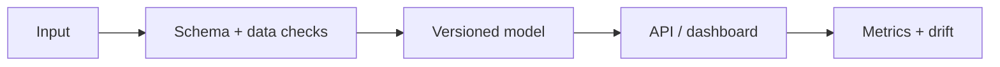

# Hierarchical Language Model


[](https://www.pinecone.io/)


Hierarchical Language Model is a research-oriented PyTorch and FastAPI project for
document representation learning. It demonstrates a token-to-sentence-to-document
pipeline with deterministic tests, API contract validation, benchmark capture, and
deployment hygiene suitable for continued production hardening.

The live Hugging Face generation path is intentionally opt-in. Local tests and CI use
safe deterministic paths so the project remains reproducible without gated model
credentials, GPU hardware, or large model downloads.


## Production Readiness Guide

> This section is the portfolio audit entry point for **-Hierarchical-Language-Model**. It describes an engineering promotion path; it is not a claim that the repository is already production-authorized.

[](https://github.com/CoreyLeath-code/-Hierarchical-Language-Model/actions) [](https://github.com/CoreyLeath-code/-Hierarchical-Language-Model/blob/main/LICENSE)

### Architecture flowchart



### Quickstart and local validation

The supported local path should be reproducible from a clean checkout. The inferred stack for this repository is **Python/ML**.

```bash
python -m venv .venv && source .venv/bin/activate && pip install -r requirements.txt
pytest -q
```

If the project uses external services, model artifacts, cloud credentials, or private data, start them through documented local fixtures or mocks. Never place secrets or identifiable records in the repository.

### Research-style metrics and benchmarks

| Evidence | Required record |
|---|---|
| Correctness | Test command, commit SHA, runtime, and pass/fail result |
| Performance | Warm-up, sample count, concurrency, median, p95, p99, throughput, and memory |
| Data/model quality | Dataset version, split strategy, leakage controls, calibration, subgroup results, and uncertainty |
| Runtime | Image digest, health-check latency, resource limits, and rollback target |
| Security | Dependency, secret, SAST, container, and SBOM results |

A benchmark number belongs in a versioned artifact tied to a commit and hardware/runtime description. Engineering benchmarks must not be presented as clinical, financial, safety, or model-quality validation without the appropriate domain evidence.

### Extended Q&A

**What is production-ready for this repository?**  
A reproducible build, tested public contract, controlled configuration, observable runtime, documented security boundary, versioned artifacts, and a tested rollback path.

**What must remain explicit?**  
The intended use, excluded use, data/credential handling, model or algorithm limitations, and which metrics are measured versus aspirational.

**What should be completed next?**  
Use the linked production-readiness issue for this repository as the checklist. Resolve missing tests, deployment instructions, observability, supply-chain controls, and release evidence before attaching a production claim.


## Architecture

```text
Document text
   |
   v
HierarchicalTokenizer
   |
   v
[batch, max_sentences, max_seq_len]
   |
   v
TokenEncoder -> Document GRU -> Classifier logits

FastAPI /generate
   |
   +-- safe fallback by default
   +-- live Hugging Face model when HLM_ENABLE_LIVE_MODEL=true
```

## Repository Layout

```text
api/                    FastAPI request schema and generation gateway
benchmarks/             Deterministic latency benchmark harness
deployment/             Docker Compose deployment blueprint
hierarchical_lm/        Core config, tokenizer, dataset, and model package
src/                    Extended encoder, RAG, provider, and ingestion prototypes
tests/                  Unit, API contract, and tensor-shape regression tests
benchmark-results.json  Recorded benchmark output
metrics.md              Research metrics and quality summary
```

## Pinecone vector retrieval

The RAG layer supports two interchangeable vector-store backends:

| Backend | Use case | Credentials |
|---|---|---|
| `faiss` (default) | Offline development, CI, and reproducible local experiments | None |
| `pinecone` | Hosted retrieval for a deployed service | `PINECONE_API_KEY`, index name, and namespace |

Pinecone is opt-in. Create a Pinecone index whose dimension matches the configured embedding model, then configure the environment without committing secrets:

```bash
cp .env.example .env
# Set these values in .env or your deployment secret store:
VECTORSTORE_BACKEND=pinecone
PINECONE_API_KEY=***
PINECONE_INDEX_NAME=hlm-documents
PINECONE_NAMESPACE=hlm-documents
EMBEDDING_MODEL=sentence-transformers/all-MiniLM-L6-v2
```

The embedding model above produces 384-dimensional vectors; the Pinecone index must use the same dimension and a compatible cosine metric. Ingest documents into the configured namespace:

```bash
python -m src.ingest --folders data docs
```

The existing `src/chains/rag.py` chain automatically loads the selected backend. Keep `VECTORSTORE_BACKEND=faiss` for local tests and CI; Pinecone credentials are never required for the deterministic fallback path. Pinecone network errors should be handled by the deployment's readiness and retry policy before exposing the RAG endpoint publicly.

## Research Metrics And Benchmarks

Latest recorded benchmark command:

```bash
python benchmarks/benchmark_hlm.py --iterations 100 --output benchmark-results.json
python -m json.tool benchmark-results.json
```

| Benchmark | Mean latency | Median latency | p95 latency | Evidence |
|---|---:|---:|---:|---|
| Tokenizer document encoding | 0.007402 ms | 0.006550 ms | 0.008000 ms | `benchmark-results.json` |
| Dataset materialization | 0.028561 ms | 0.025100 ms | 0.044400 ms | `benchmark-results.json` |
| Model forward pass | 2.207161 ms | 2.189750 ms | 2.790500 ms | `benchmark-results.json` |
| API safe fallback generation | 0.000217 ms | 0.000200 ms | 0.000200 ms | `benchmark-results.json` |

| Quality signal | Recorded value |
|---|---:|
| Tests | 13 passing |
| Runtime package coverage | 87% |
| Benchmark JSON validation | Passing |
| Live model downloads required for CI | 0 |
| Case-conflicting tracked log files | Resolved to `dailylog.md` |

See [metrics.md](metrics.md) for the full research metrics table and production target metrics.

## 9 Tier Deployment Hygiene

| Tier | Gate | Purpose |
|---:|---|---|
| 1 | Checkout source | Reproducible source snapshot |
| 2 | Python runtime setup | Standard Ubuntu latest runtime with pip cache |
| 3 | Dependency installation | Runtime and dev dependencies installed explicitly |
| 4 | Ruff static lint | Syntax, import, and maintainability checks |
| 5 | Ruff format verification | Consistent source formatting |
| 6 | Python import compilation | Import-time and syntax validation |
| 7 | Unit, API, and coverage tests | Regression coverage for core runtime behavior |
| 8 | Benchmark JSON validation | Machine-readable performance evidence |
| 9 | Docker, Bandit, and pip-audit | Deployment build, SAST, and dependency vulnerability hygiene |

## Quick Start

```bash
python -m venv .venv
. .venv/bin/activate
python -m pip install --upgrade pip
python -m pip install -r requirements.txt -r requirements-dev.txt
pytest
```

Run the API in safe fallback mode:

```bash
uvicorn api.main:app --reload --host 0.0.0.0 --port 8000
curl -X POST http://localhost:8000/generate \
  -H "Content-Type: application/json" \
  -d '{"prompt":"Explain hierarchical reasoning","max_tokens":64}'
```

Enable live model generation only when credentials, hardware, and model access are ready:

```bash
export HLM_ENABLE_LIVE_MODEL=true
export HLM_MODEL_NAME=meta-llama/Meta-Llama-3-8B-Instruct
export HLM_MODEL_REVISION=main
uvicorn api.main:app --host 0.0.0.0 --port 8000
```

## Validation

```bash
ruff check api hierarchical_lm benchmarks tests
ruff format --check api hierarchical_lm benchmarks tests
pytest --cov=api --cov=hierarchical_lm --cov-report=term-missing
python benchmarks/benchmark_hlm.py --iterations 100 --output benchmark-results.json
python -m json.tool benchmark-results.json
python -m compileall -q api hierarchical_lm benchmarks tests src
```

## Deployment

Build the container:

```bash
docker build -t hierarchical-language-model:latest .
```

Run the local deployment blueprint:

```bash
docker compose -f deployment/docker-compose.yml up --build
```

## Known Gaps

- The deterministic benchmark uses compact synthetic inputs; it is not a large-corpus model-quality evaluation.
- Live Hugging Face generation requires explicit opt-in and valid model access.
- The RAG and dashboard modules remain prototype extensions and are not part of the core CI coverage gate.
- Production auth, rate limiting, TLS, model registry controls, and observability backends should be added before internet-facing deployment.

## Author

Corey Leath

AI / ML Engineer focused on LLM systems, MLOps, and distributed AI infrastructure.
