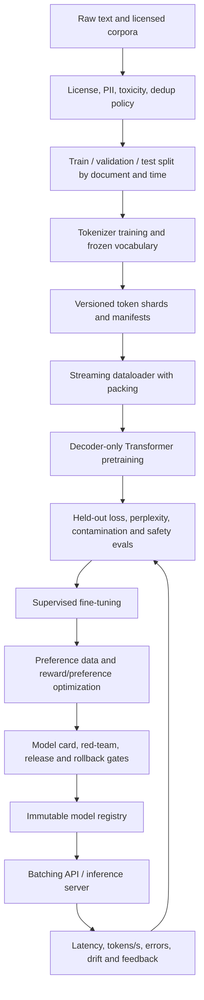

# From-Scratch LLM Systems Research Track

This document is the engineering contract for the repository's LLM research path. It
explains the path from data to serving, names the technology at each boundary, and
separates measured evidence from targets that still require experiments. The reference
implementation is intentionally small enough to run on a laptop and structurally similar
to a decoder-only Transformer used in larger systems.

> This is a research and systems portfolio project. It is not a frontier model, a safety
> evaluation, or a claim of production authorization.

## 1. Research question and design constraints

The project asks: **How do data quality, compute allocation, model scale, and post-training
choices change the behavior and serving cost of a causal language model?**

The first implementation prioritizes:

- inspectable PyTorch modules instead of opaque trainer magic;
- deterministic synthetic tests before expensive corpus experiments;
- explicit provenance for data, tokenizer, configuration, commit, seed, and hardware;
- benchmark artifacts that include warm-up, sample count, percentile latency, and throughput;
- opt-in external services so CI never needs private credentials or a GPU;
- safety and governance gates before a model can be described as deployable.

The compact model in `research/llm_from_scratch.py` includes RMSNorm, causal scaled-dot-product
attention, SwiGLU, residual blocks, learned positional embeddings, tied input/output
embeddings, and next-token cross-entropy. It is a reference architecture, not a shortcut to
frontier capability.

## 2. End-to-end architecture



### Technology map

| Boundary | Reference technology | Why it is used | Evidence produced |
|---|---|---|---|
| Data manifests | JSONL + SHA-256 manifests | Auditable, diffable provenance | corpus versions, licenses, hashes |
| Cleaning | Python rules + deterministic tests | Explicit transformations before scale | removal counts and policy decisions |
| Tokenization | SentencePiece or Hugging Face Tokenizers | Fast subword vocabulary training | vocab hash, fertility, OOV proxy |
| Storage | local shards first; object storage later | Reproducible laptop path and scalable path | shard manifest and byte counts |
| Training | PyTorch modules and distributed DDP/FSDP at scale | Transparent baseline, then memory-efficient parallelism | loss curves, tokens, FLOPs, checkpoints |
| Evaluation | Python harness + fixed JSON schemas | Machine-readable comparisons | loss, perplexity, quality, safety |
| Experiment tracking | JSON artifacts first; MLflow/W&B later | No SaaS dependency for CI | config, seed, commit, environment |
| Serving | FastAPI baseline; vLLM/TGI at scale | Contract tests locally, continuous batching later | p50/p95/p99, tokens/s, errors |
| Retrieval | FAISS offline; Pinecone opt-in | Deterministic CI and hosted path | recall@k, latency, namespace |
| Security | Gitleaks, Bandit, pip-audit, CodeQL, SBOM | Supply-chain and source controls | SARIF, dependency report, SBOM |
| Packaging | Docker, non-root user, pinned lock inputs | Same artifact from CI to deployment | image digest and startup evidence |

## 3. Data path

### 3.1 Acquisition and governance

Every source enters through a manifest with:

```json
{
  "source_id": "example-corpus-001",
  "license": "documented-license",
  "retrieved_at": "YYYY-MM-DD",
  "url_or_owner": "approved-source",
  "sha256": "sha256-of-raw-export",
  "allowed_use": "research-only",
  "pii_review": "required|passed|blocked"
}
```

The project should reject a source when its license, provenance, PII disposition, or
allowed use is unknown. Raw private records do not belong in Git. Synthetic fixtures are
for pipeline tests only and must never be reported as representative model quality.

### 3.2 Cleaning and filtering

The cleaning pipeline is ordered so that each step can be measured:

1. normalize Unicode and line endings;
2. remove exact duplicates by normalized-content hash;
3. remove near duplicates using MinHash/LSH at corpus scale;
4. filter language and minimum document quality;
5. detect PII and secrets before tokenization;
6. apply toxicity and policy filters with logged false-positive review;
7. split by document and time to prevent leakage;
8. write immutable shards and a manifest.

Required counters are input documents, output documents, removed duplicates, filtered
documents by reason, token count, bytes, language distribution, and review sample size.

### 3.3 Tokenization and packing

Tokenizer training is a separate versioned experiment. Record vocabulary size, normalization,
special-token IDs, training corpus hash, and tokenizer hash. For causal training, pack token
sequences into fixed context windows while preserving document-boundary markers. Report
padding fraction and average packed tokens; otherwise throughput comparisons are misleading.

## 4. Model path

### 4.1 Baseline decoder

The reference path is:

```text
token IDs
  -> token embedding + position embedding
  -> [RMSNorm -> causal attention -> residual]
  -> [RMSNorm -> SwiGLU -> residual] repeated L times
  -> RMSNorm
  -> tied vocabulary projection
  -> next-token logits
  -> shifted cross-entropy
```

The implementation uses `torch.nn.functional.scaled_dot_product_attention` so the same
module can use an optimized kernel when the installed PyTorch/runtime supports it. The
mathematical contract remains causal: position *t* cannot attend to positions greater than
*t*. Tests should verify tensor shapes, causal masking, deterministic seeds, tied weights,
and loss calculation.

### 4.2 Scaling path

Do not jump directly from a laptop model to a distributed cluster. Promote through:

1. single-process CPU/GPU correctness;
2. mixed precision on one accelerator;
3. gradient accumulation and activation checkpointing;
4. DDP for data parallelism;
5. FSDP or ZeRO for sharded parameters/optimizer state;
6. tensor/pipeline parallelism only when model size requires it;
7. object-storage checkpointing, elastic recovery, and spot/preemption tests.

Each promotion keeps the same config schema and evaluation suite. A larger run is not
evidence of improvement unless the data mixture, token budget, optimizer, evaluation set,
and stopping rule are comparable.

### 4.3 Compute and scaling-law protocol

For each model size, record parameters `N`, training tokens `D`, optimizer steps,
batch tokens, wall-clock time, hardware, peak memory, achieved tokens/second, and final
held-out loss. Fit a declared function only after collecting multiple points; never fit a
scaling law to one run.

A practical first experiment is a grid over:

| Run | Layers | Width | Heads | Context | Tokens |
|---|---:|---:|---:|---:|---:|
| S | 2 | 128 | 4 | 128 | fixed |
| M | 4 | 256 | 8 | 256 | fixed |
| L | 8 | 512 | 8 | 512 | fixed |

The script reports system performance, not a fabricated quality claim. A loss-scaling study
needs real held-out data and should report:

- `L(N, D) = E + A / N^alpha + B / D^beta` with fit confidence intervals;
- data/compute allocation and total training FLOPs;
- train/validation gap and contamination audit;
- seed count and fit sensitivity;
- extrapolation range and residual plots.

The fit is invalid if the optimizer, tokenizer, data mixture, or evaluation protocol changes
between points without being modeled.

## 5. Post-training path

Post-training is a separate data and objective boundary:

1. **Supervised fine-tuning (SFT):** curated instruction/response pairs, loss masked to the
   assistant span, held-out task and safety sets.
2. **Preference optimization:** pairwise preferences with annotator policy, inter-rater
   agreement, disagreement handling, and reward-hacking checks. Start with DPO-style
   objectives before introducing a learned reward model.
3. **Tool and retrieval grounding:** tool schemas, citation checks, adversarial tool inputs,
   retrieval recall@k, and grounded-answer rate.
4. **Safety tuning:** refusal/helpfulness trade-off, jailbreak suite, privacy probes,
   disallowed-content policy, and regression tests.
5. **Release gate:** compare base, SFT, and preference checkpoints on the same frozen
   evaluation suite; publish deltas, uncertainty, and known regressions.

Never report preference win rate without the sample count, pair construction, evaluator
version, confidence interval, and ties. Human evaluation requires an adjudication protocol;
an LLM judge is a useful auxiliary signal, not ground truth.

## 6. Reproducible benchmark contract

Run the reference smoke test:

```bash
python research/llm_from_scratch.py \
  --mode smoke \
  --steps 5 \
  --device cpu \
  --output artifacts/llm-smoke.json
```

Run a hardware benchmark:

```bash
python research/llm_from_scratch.py \
  --mode benchmark \
  --iterations 30 \
  --batch-size 2 \
  --device cpu \
  --output artifacts/llm-benchmark.json
```

For each result, preserve:

- command line, commit SHA, Python/PyTorch versions, OS, device, and seed;
- model dimensions and parameter count;
- warm-up count, iterations, batch size, sequence length, and precision;
- median, p95, p99 latency and tokens/second;
- peak memory for accelerator runs;
- whether compilation, flash attention, quantization, or caching was enabled.

A benchmark result is reproducible only when the environment and input contract are
recreated. The checked-in `benchmark-results.json` remains the existing hierarchical-model
baseline; new LLM results belong in `artifacts/` and must not overwrite it.

### Metrics table

| Category | Metric | Required comparison |
|---|---|---|
| Optimization | train loss, validation loss, perplexity | base vs SFT vs preference checkpoint |
| Efficiency | tokens/s, step time, peak memory, utilization | same batch/context/hardware |
| Serving | time-to-first-token, inter-token latency, p50/p95/p99 | concurrency sweep |
| Data | duplicate rate, token count, language mix, PII findings | manifest-to-manifest |
| Grounding | recall@k, MRR, citation precision, grounded-answer rate | fixed query set |
| Safety | refusal precision/recall, jailbreak success, privacy leakage | frozen policy suite |
| Reliability | error rate, restart recovery, checkpoint restore | injected-failure test |

No numerical quality score should be populated until the corresponding dataset, method, and
confidence interval are versioned alongside the result.

## 7. Promotion gates

A checkpoint can advance only when:

- data and license review is complete;
- training and evaluation manifests are immutable;
- leakage and contamination checks are recorded;
- quality, safety, and regression results meet declared thresholds;
- the model card states intended and excluded uses;
- the serving artifact is reproducible and rollback-tested;
- security, dependency, secret, and container scans pass;
- an owner approves release and an incident/rollback path exists.

## 8. Suggested research sequence

| Phase | Deliverable | Exit evidence |
|---|---|---|
| 0 | deterministic architecture smoke test | shapes, loss, seed, environment |
| 1 | tokenizer and data manifest | hashes, license table, filtering counters |
| 2 | small pretraining run | loss curve and held-out evaluation |
| 3 | scaling grid | N/D/compute table and fit diagnostics |
| 4 | SFT baseline | masked loss and task regression suite |
| 5 | preference optimization | pair protocol and human/auxiliary evaluation |
| 6 | serving hardening | load test, p95/p99, failure recovery |
| 7 | release candidate | model card, SBOM, signed artifact, rollback drill |

The next honest milestone is not “frontier model.” It is a fully reproducible small-model
experiment whose data, code, compute, evaluation, and limitations another engineer can
audit from a clean checkout.
